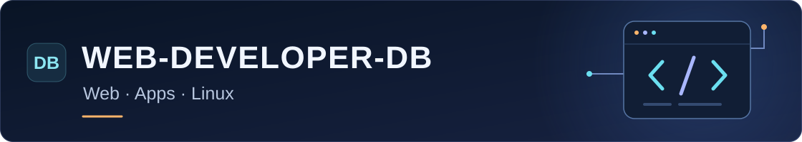
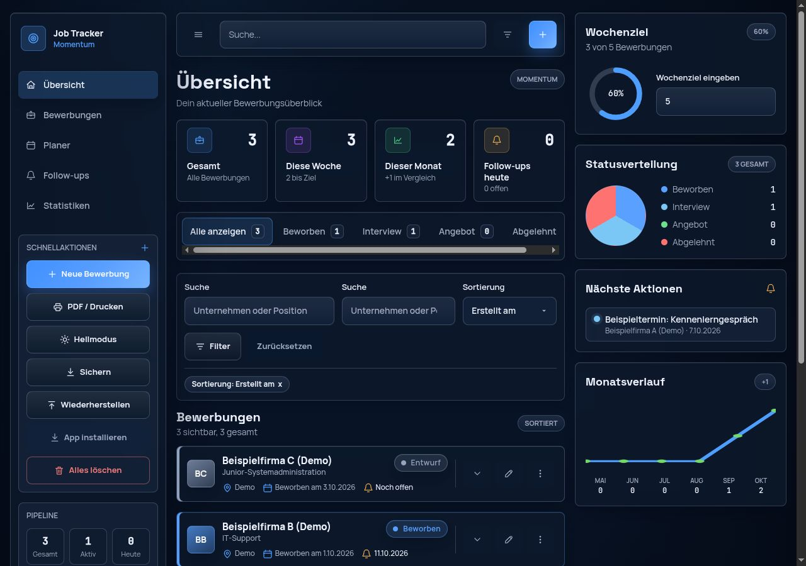

<!--
PFLEGEHINWEISE FÜR DIESES GITHUB-PROFIL
Diese Datei ist die öffentliche Profilseite; Kommentare sind nur im Quelltext sichtbar.
Reihenfolge: Einstieg → Projektorientierung → Hauptprojekte → persönlicher Hintergrund
→ Kenntnisse → weitere Projekte → Kontakt. Webentwicklung und IT sind das Berufsziel;
Elektronik beschreibt die bisherige Berufspraxis. Private Kontaktdaten und Bewerbungsdaten
nicht übernehmen. Aussagen zu Kenntnissen, Projektständen und Ergebnissen anhand der
jeweiligen Repository-Dokumentation prüfen; private Praxis als solche benennen.
Layout: GitHub-kompatibles Markdown/HTML und eigenständige SVGs in assets/ verwenden.
Keine Abhängigkeit von eigener CSS-Datei, JavaScript oder dynamischen Badge-Diensten.
Nach Änderungen: Bilder, externe Links, Sprungziele und details prüfen; bei 390 und 1280 px
in heller/dunkler Ansicht ansehen; SVGs als XML prüfen und git diff --check ausführen.
-->

<!-- EINSTIEG: Banner 1120 × 200; berufliche Überschrift nur einmal darunter. -->

  

<h1 align="center">Webentwicklung &amp; IT</h1>

  Ich möchte beruflich in die <strong>Webentwicklung und weitere IT-Aufgaben</strong> einsteigen. 
  Meine Basis sind eine <strong>Vollzeit-Weiterbildung im MERN-Stack</strong>, eigene Software- und Linux-Projekte sowie <strong>mehr als 20 Jahre technische Berufspraxis</strong> mit Fehlersuche, Prüfungen und Dokumentation.

  <a href="https://portfolio-web-developer-db.vercel.app"><strong>Portfolio ansehen ↗</strong></a>
  &nbsp; · &nbsp;
  <a href="#user-content-ausgewaehlte-projekte"><strong>Projekte entdecken ↓</strong></a>
  &nbsp; · &nbsp;
  <a href="https://portfolio-web-developer-db.vercel.app/#contact"><strong>Kontakt aufnehmen ↗</strong></a>

<strong>Offen für Webentwicklung, IT-Support und Junior-Systemadministration.</strong>

---

## Ausgewählte Projekte

<!--
HAUPTPROJEKTE ERWEITERN
Ein Projektblock besteht aus: eindeutigem Sprungziel, verlinktem Banner (1040 × 110),
Überschrift, Kurzbeschreibung (höchstens 70 Wörter: Problem/eigener Beitrag/Stand),
4–6 zentralen Technologien, Nachweislinks und optionaler echter Vorschau sowie details.
Sprungziele als  mit identischen Werten anlegen;
GitHub ergänzt beim Rendern den Präfix user-content-: Links auf dieser Profilseite daher
als #user-content-projektname setzen. Eine lokale Vorschau muss denselben Präfix ergänzen.
Den stabilen Namen auch bei neuen Titeln behalten; Sprünge direkt auf GitHub prüfen.
Zum Ergänzen einen vorhandenen Block kopieren und Anker, Links, Bildpfade, Alt-Texte,
Banner-Texte und Nummer anpassen. Neue Anker zugleich in der Orientierung verlinken.
Bei einer Umordnung die Nummern aller betroffenen Banner und Alt-Texte abgleichen.
Bilder proportional skalieren, zur vollständigen Ansicht verlinken und beschriften.
Demodaten ausdrücklich kennzeichnen; keine persönlichen Daten in Screenshots zeigen.
Leerzeilen innerhalb der details erhalten, damit GitHub Markdown korrekt rendert.
-->

- **Webentwicklung:** [Job Tracker](#user-content-job-tracker)
- **Linux & Server:** [T95 Home Server](#user-content-t95-home-server) · [Servergy](#user-content-servergy)
- **KI & Automatisierung:** [ApplyFoundry](#user-content-applyfoundry)

<!--
JOB TRACKER: Vorschau in assets/job-tracker-preview.jpg, Anzeige mit 480 px Breite.
Für neue Aufnahmen eine isolierte lokale App-Instanz mit fiktiven Bewerbungen verwenden;
über das versionierte Backup-Format (Job-Tracker/src/types.ts) importieren, Dunkelmodus
bei 1280 × 900 aufnehmen. Persönliche Browserdaten dabei nicht verändern.
-->

### Job Tracker · Bewerbungen im Überblick

Mit dem Job Tracker habe ich eine App gebaut, die Bewerbungen, Termine und Follow-ups zusammenführt. Sie funktioniert ohne Benutzerkonto und lässt sich als PWA installieren. Die Daten bleiben im eigenen Browser und können als JSON gesichert werden. Ich habe Oberfläche, Bewerbungslogik und Speicherung getrennt aufgebaut und wichtige Abläufe durch Tests abgesichert.

`React` · `TypeScript` · `Tailwind CSS` · `Zustand` · `IndexedDB` · `Vitest`

**[Live ausprobieren ↗](https://job-tracker-three-iota.vercel.app/) · [Code & Architektur ↗](https://github.com/Web-Developer-DB/Job-Tracker)**

  

*Job Tracker mit fiktiven Demodaten. Bild anklicken für die vollständige Ansicht.*

Architektur und Tests

Oberfläche, Bewerbungslogik und Speicherung liegen in getrennten Schichten. So lässt sich die Logik unabhängig von der Oberfläche testen. Die Tests prüfen unter anderem Statusverläufe, Backups und die lokale Speicherung mit IndexedDB und Fallback. Die Dokumentation im Repository beschreibt die Schichten und die getesteten Abläufe.

 

<!-- T95: Ergebnisse auf die tatsächlich geprüfte Platine beziehen; Bildbreite 320 px. -->

### T95 Home Server · Hardware verstehen, Fehler lösen

Ich habe eine T95-TV-Box zum Linux-Homeserver umgebaut. Für diese Platine mussten Bootvorgang und Netzwerk angepasst werden. Über serielle Bootlogs habe ich die Fehler eingegrenzt und die nötigen Änderungen dokumentiert. Auf der geprüften Platine funktionieren jetzt der Start von microSD, Ethernet, SSH und Dateizugriff. Ein reproduzierbares Release-Image hält das Ergebnis fest.

`Linux` · `Armbian` · `Bash` · `U-Boot` · `UART` · `Samba`

**[Projekt & Ergebnis ↗](https://github.com/Web-Developer-DB/t95-tvbox-to-armbian-home-server) · [Technische Änderungen ↗](https://github.com/Web-Developer-DB/t95-tvbox-to-armbian-home-server/blob/main/docs/CHANGES_FROM_ARMBIAN.md)**

  

*Die Platine aus meinem Server-Projekt. Bild anklicken für die vollständige Ansicht.*

Bootdiagnose, Änderungen und UART-Adapter

Die vorhandene Android-Installation galt als nicht vertrauenswürdig. Für die konkrete Platine habe ich U-Boot und den Gerätebaum angepasst sowie Speicherinitialisierung und AC300-Ethernet geprüft. Zur Fehlersuche dienten serielle Bootlogs über UART. Die Dokumentation hält die einzelnen Änderungen und ihre Gründe fest; eine optionale Samba-/USB-Dateiserver-Schicht ergänzt das System.

Zum Diagnosepfad gehört das separate [RP2040-Zero-UART-Adapterprojekt](https://github.com/Web-Developer-DB/rp2040-zero-uart-adapter). Es dokumentiert Firmware, Verdrahtung und die Aufzeichnung serieller Bootlogs.

 

<!-- SERVERGY: Entwicklungs-/Release-Stand prüfen; WOL setzt geeignete Hardware und Einrichtung voraus. Keine T95-Unterstützung ableiten. -->

### Servergy · Den Homeserver im Alltag steuern

Mit Servergy entwickle ich eine lokale Flutter-App für einen eingerichteten Debian- oder Ubuntu-Homeserver. Sie prüft die SSH-Verbindung, startet geeignete Hardware über Wake-on-LAN und fährt den Server kontrolliert herunter. Dafür verbinde ich App-Oberfläche, Netzwerkfunktionen und Linux-Konfiguration. Wake-on-LAN muss von Hardware und System unterstützt und eingerichtet sein.

`Flutter` · `Dart` · `Wake-on-LAN` · `SSH` · `Linux` · `systemd`

*Aktive Entwicklung; ein veröffentlichter Release steht noch aus.*

**[Projekt & App-Vorschau ↗](https://github.com/Web-Developer-DB/Servergy) · [Architektur ↗](https://github.com/Web-Developer-DB/Servergy/blob/main/docs/architecture.md) · [Server-Einrichtung ↗](https://github.com/Web-Developer-DB/Servergy/blob/main/docs/server-setup.md)**

  

*Servergy: Dashboard und Einstellungen. Bild anklicken für die vollständige Ansicht.*

Zugriffsrechte und Servereinrichtung

Die App prüft den SSH-Host-Key und verwendet für das Herunterfahren einen begrenzten Helper mit einer festen systemd-Unit. Zugangsdaten liegen im sicheren Speicher des Geräts. Die Serveranleitung dokumentiert die nötige Einrichtung und die begrenzten Rechte für den Shutdown-Aufruf.

 

<!-- APPLYFOUNDRY: Bewerbungsworkflow mit Python-Prüfungen und persönlicher Freigabe; keine berufliche KI-Engineering-Erfahrung behaupten. -->

### ApplyFoundry · KI-Workflows mit Nachweisen

Mit ApplyFoundry entwickle ich einen KI-gestützten Bewerbungsworkflow mit nachvollziehbaren Prüfungen. Coding-Agenten nutzen Stellenanforderungen und belegte Profildaten; ein Python-Kern prüft Dokumente, Layout und PDF-Ausgabe. Ich verbinde die Automatisierung mit dateigebundenen Prüfnachweisen und einer persönlichen Freigabe. So lässt sich nachvollziehen, welcher Dokumentstand geprüft wurde und ob er danach verändert wurde.

`Python` · `AGENTS.md` · `Prompt-Architektur` · `GitHub Actions` · `PDF / ATS`

**[Workflow & Architektur ↗](https://github.com/Web-Developer-DB/apply-foundry) · [Tests & CI ↗](https://github.com/Web-Developer-DB/apply-foundry/actions)**

Prüfmechanismen und persönliche Freigabe

Der Python-Kern prüft Inhalt, Seitenlayout, PDF-Export und die Lesbarkeit für Bewerbermanagementsysteme (ATS). Prüfberichte sind an die jeweiligen Dateien gebunden. Wird ein Dokument geändert, gilt die vorherige Prüfung dafür nicht mehr. Die persönliche Kontrolle gehört zur Freigabe. Arbeitsdateien und Freigabe liegen lokal; die Modellverarbeitung hängt vom eingesetzten Agenten ab.

---

## Mein Weg in die IT

<!-- PERSÖNLICHER HINTERGRUND: Eigene Erfahrungen konkret beschreiben. KI bleibt Unterstützung mit eigener Ergebnisprüfung. -->
IT-Technologien interessieren mich schon mein Leben lang. Mit PCs beschäftige ich mich seit DOS und den frühen Windows-Versionen. Ich baue und rüste meine eigenen Rechner auf. Bei Problemen mit PCs, Routern, WLAN, Internet oder Telefonie suche ich im privaten Umfeld nach der Ursache und einer funktionierenden Lösung.

Meine Vollzeit-Weiterbildung in Webentwicklung habe ich am **Digital Career Institute** absolviert. Im privaten Homelab beschäftige ich mich mit Linux, einem Debian-Homeserver und Netzwerkthemen.

Aus meiner bisherigen Arbeit als **Elektroniker** kenne ich das Löten elektronischer Baugruppen, elektrische Messungen und Prüfungen sowie Qualitätskontrolle. Arbeitsergebnisse dokumentieren und neue Kollegen in technische Abläufe einarbeiten gehörten ebenfalls dazu. Die systematische Fehlersuche nehme ich in meine IT-Projekte mit.

Neue Technologien probiere ich gern praktisch aus, besonders **KI und Automatisierung**. Ich teste, wo sie mir bei Recherche, Entwicklung und wiederkehrenden Aufgaben helfen, und setze brauchbare Ansätze in meinen Projekten ein. Dabei nutze ich sie als Unterstützung, um produktiver zu arbeiten. Die technischen Entscheidungen und die Prüfung der Ergebnisse bleiben bei mir.

## Kenntnisse & Arbeitsweise

<!-- KENNTNISSE: Herkunft je Zeile erhalten. Lernziele und Grundlagen nicht als berufliche Erfahrung ausgeben; Elektronik bleibt am Ende. -->
| Bereich & Grundlage | Kenntnisse & Praxis |
| --- | --- |
| **Webentwicklung** Weiterbildung und Projekte | React, TypeScript, JavaScript, Tailwind CSS, Node.js, Express, MongoDB und REST-APIs |
| **Linux & Server** Privates Homelab und Projekte | Debian, Armbian, SSH, Benutzer und Rechte, Paketverwaltung, systemd, Log-Analyse und Samba; Docker-Grundlagen |
| **PCs & Windows** Private Praxis | PC-Bau, Aufrüstung, Hardwarediagnose, Windows 10/11, Programme einrichten und Fehler an Geräten beheben |
| **Netzwerk** Private Praxis und Grundlagen | Router- und WLAN-Fehlersuche; Grundlagen in TCP/IP, DNS, DHCP, VPN und Firewall |
| **Appentwicklung** Eigene Projekte | Flutter und Dart; Wake-on-LAN und SSH-Steuerung in Servergy |
| **Tests & Werkzeuge** Eigene Projekte | Vitest, Jest, Testing Library, Flutter-Tests, GitHub Actions und Git |
| **KI & Automatisierung** Private Praxis und eigene Projekte | Recherche, agentenbasierte Workflows, Python/Bash und Prüfung der Ergebnisse |
| **Elektronik** Bisherige Berufspraxis | Löten, elektrische Messungen und Prüfungen, Fehleranalyse, Qualitätskontrolle, Dokumentation und technische Einarbeitung |

## Weitere Webprojekte

<!-- WEITERE PROJEKTE: Kurze Beschreibungen und wenige Technologien; umfangreiche Vorschauen in details. Größere Projekte bei Bedarf oben einordnen. -->
**[E-Bike Akku-Rechner ↗](https://github.com/Web-Developer-DB/E-Bike-Akku-Rechner)** · Mobile PWA für Reichweiten- und Reifendruckschätzung. Testbare Berechnungen, automatische Sprachwahl (DE/EN), Offline-Nutzung und lokale Einstellungen.

`React` · `TypeScript` · `Vitest` · `PWA`

Die mobile Oberfläche ansehen

  
  

*Versionierte Screenshots aus dem Projekt-Repository.*

**[Logorama ↗](https://github.com/Web-Developer-DB/Logorama)** · Offline-fähiges Lern- und Projektjournal mit Suche, Papierkorb, JSON-Backups und Tests für Komponenten und Seiten. **[Live ausprobieren ↗](https://logorama.vercel.app)**

`React` · `Vite` · `Jest` · `PWA`

<strong>Weitere Projekte entdecken</strong>

- [CarsServiceLog](https://github.com/Web-Developer-DB/CarsServiceLog) – lokale Fahrzeugakte mit Wartung, Kostenübersicht und Backup
- [CarService Backend](https://github.com/Web-Developer-DB/CarService-Backend) – REST-API für Benutzer- und Fahrzeugdaten mit Authentifizierung
- [Pilze Marinade](https://github.com/Web-Developer-DB/Pilze_Marinade) – mehrsprachiger Säurerechner mit Validierung und Rezepten
- [Survival List](https://github.com/Web-Developer-DB/Survival_List) – installierbare Vorratsplanung mit Offline- und Druckansicht

---

## Kontakt

<!-- KONTAKT: Berufsziel Webentwicklung/IT und systemnahe Aufgaben mit Einarbeitung; Kontakt über die vorhandene Portfolio-Seite. -->
Ich möchte beruflich in die **Webentwicklung oder ein anderes IT-Berufsfeld** einsteigen. Neben Entwicklungsstellen interessieren mich IT-Support, Junior-Systemadministration und andere systemnahe Aufgaben mit Einarbeitung. Dabei möchte ich meine Weiterbildung, meine Projekte und meine technische Erfahrung einsetzen. Wenn mein Hintergrund zu eurem Team passt, freue ich mich über eine Nachricht.

**[Portfolio & Kontakt ↗](https://portfolio-web-developer-db.vercel.app/#contact)** · [Alle Repositories ↗](https://github.com/Web-Developer-DB?tab=repositories)

  

